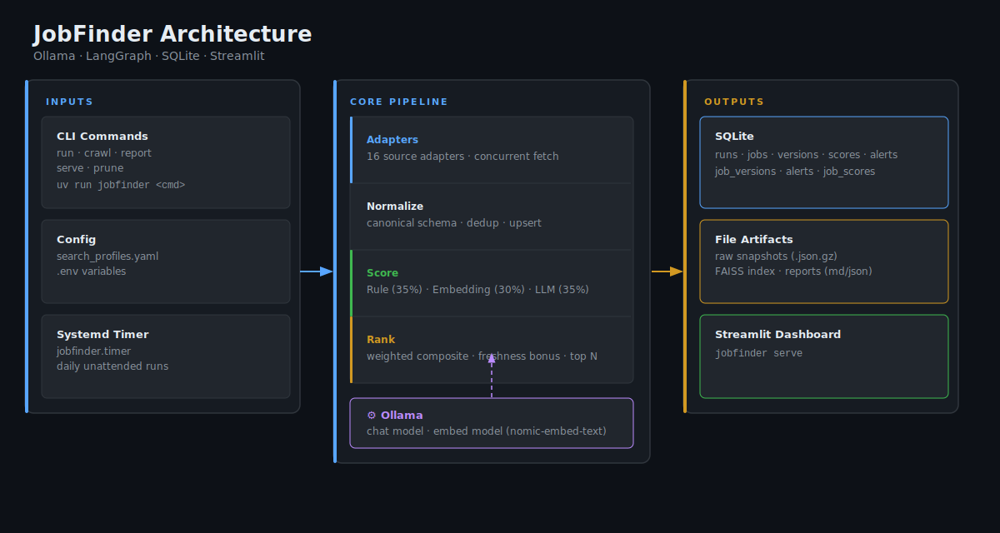
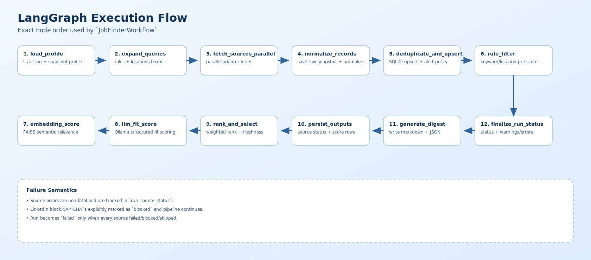
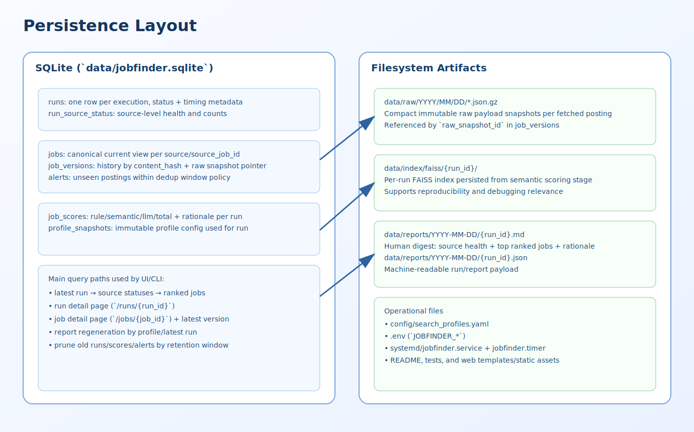

# JobFinder

Local-first AI job monitoring agent built with **Ollama + LangChain/LangGraph + Streamlit + SQLite + FAISS**, managed with **uv**.

JobFinder crawls public job pages, normalizes postings into a single schema, scores relevance against your search profile (Madrid ML + Applied Research by default), and stores everything locally for reporting and dashboard review.

## What Is Implemented

- Public-source adapters (API-first with HTML fallback where possible):
  - LinkedIn (guest search, best effort)
  - Amazon Jobs
  - Meta Careers
  - Google Careers
  - DeepMind (Greenhouse)
  - Microsoft Careers
  - Adobe Careers
  - Stability AI Careers
  - Hugging Face (Workable)
  - NVIDIA Careers
  - Apple Jobs
  - IBM Careers
  - OpenAI Careers
  - Anthropic Careers
  - Mistral (Lever)
  - Runway Careers
- LangGraph workflow with 12 explicit nodes from profile load to run finalization.
- Hybrid ranking:
  - rule score
  - semantic score (Ollama embeddings + FAISS)
  - LLM fit score (Ollama chat model)
- Local persistence:
  - SQLite (`runs`, `jobs`, `job_versions`, `alerts`, `job_scores`, ...)
  - raw snapshots (`data/raw/.../*.json.gz`)
  - per-run reports (Markdown + JSON)
  - FAISS index artifacts
- Streamlit dashboard with:
  - run selection + filters
  - analytics charts
  - ranked job list (scrollable)
  - full job details and latest description snapshot
- CLI lifecycle commands:
  - `run`, `crawl`, `report`, `serve`, `prune`
- Tests for unit logic, adapter contracts, and mocked integration pipeline.

## Architecture

| | |
|---|---|
|  | System components and data flow |
|  | 12-node workflow execution |
|  | Database schema and file artifacts |

## Project Structure

```text
.
├── config/
│   └── search_profiles.yaml
├── data/
│   ├── jobfinder.sqlite
│   ├── raw/
│   ├── reports/
│   └── index/faiss/
├── docs/images/
├── src/jobfinder/
│   ├── adapters/
│   ├── graph/
│   ├── models/
│   ├── reporting/
│   ├── scoring/
│   ├── storage/
│   ├── cli.py
│   ├── service.py
│   └── streamlit_app.py
├── systemd/
├── tests/
└── pyproject.toml
```

## Quickstart

### 1. Prerequisites

- Python 3.11+
- `uv`
- Ollama running locally

### 2. Install

```bash
cp .env.example .env
uv sync --group dev --group test
```

### 3. Pull local models

```bash
ollama serve
ollama pull ministral-3:14b
ollama pull nomic-embed-text
```

### 4. Run one full pipeline pass

```bash
uv run jobfinder run --profile madrid_ml
```

Expected output includes:

- `run_id=...`
- `normalized_jobs=... ranked_jobs=...`
- `report_md=...`
- `report_json=...`

### 5. Launch dashboard

```bash
uv run jobfinder serve --host 127.0.0.1 --port 8765
```

Open `http://127.0.0.1:8765`.

## Scoring

`total = rule×0.35 + semantic×0.30 + llm×0.35`

- **Rule (35%):** title, location, skills heuristics
- **Semantic (30%):** Ollama embeddings + FAISS cosine similarity
- **LLM (35%):** Ollama chat model — role, research, location, seniority fit
- **Freshness bonus** applied in `rank_and_select` for recent postings

## Configuration

### Search profiles

File: `config/search_profiles.yaml`

Default profile `madrid_ml` contains:

- target roles + synonyms
- required/optional skills
- location policy and terms
- source toggles
- scoring weights
- digest size
- dedup window

### Environment variables

File: `.env` (copy from `.env.example`)

Key variables:

- `JOBFINDER_OLLAMA_BASE_URL`
- `JOBFINDER_OLLAMA_CHAT_MODEL`
- `JOBFINDER_OLLAMA_EMBED_MODEL`
- `JOBFINDER_REQUEST_TIMEOUT_SECONDS`
- `JOBFINDER_USER_AGENT`
- `JOBFINDER_DB_PATH`
- `JOBFINDER_REPORT_DIR`
- `JOBFINDER_RAW_DIR`
- `JOBFINDER_VECTOR_DIR`
- `JOBFINDER_RETENTION_DAYS`

## CLI Reference

Run full pipeline:

```bash
uv run jobfinder run --profile madrid_ml
```

Crawl-only (no semantic/LLM scoring):

```bash
uv run jobfinder crawl --profile madrid_ml
```

Regenerate report from stored data:

```bash
uv run jobfinder report --profile madrid_ml --top 15
uv run jobfinder report --profile madrid_ml --run-id <RUN_ID> --top 30
```

Serve Streamlit dashboard:

```bash
uv run jobfinder serve --host 127.0.0.1 --port 8765
```

Prune old data:

```bash
uv run jobfinder prune --days 180
```

## Dashboard

```bash
uv run jobfinder serve --host 127.0.0.1 --port 8765
```

Sidebar filters: run ID, text search, min score, source, new alerts only, sort mode.
Main view: KPI row → source/score charts → ranked job list → job detail with score breakdown and description.

## Testing

Run tests:

```bash
uv run --group test pytest -q
```

Coverage includes:

- query expansion
- rule scoring
- score combiner
- dedup/upsert behavior
- adapter normalization and HTML extraction
- description enrichment
- mocked end-to-end pipeline behavior

## Known Behaviors and Troubleshooting

- `POST /api/embed 404` from Ollama:
  - embedding model missing. Pull `nomic-embed-text`.
- OpenAI careers `403`:
  - expected in some regions/network setups. Adapter records warning and run continues.
- LinkedIn blocks/CAPTCHA:
  - source is marked `blocked`; run is still successful if other sources work.
- Empty descriptions in older rows:
  - re-run after adapter updates to capture richer snapshots.
- Dashboard command exits immediately:
  - usually port conflict or Streamlit startup failure; retry with another port.

## Scheduling (Optional)

Templates are included:

- `systemd/jobfinder.service`
- `systemd/jobfinder.timer`

Example user-level install:

```bash
systemctl --user daemon-reload
systemctl --user enable --now jobfinder.timer
systemctl --user list-timers | grep jobfinder
```

## Limitations

- Public pages only (no login flows).
- No anti-bot bypass.
- Source HTML/API formats can change and require adapter maintenance.
- Always verify details directly on source pages before applying.

## Roadmap Ideas

- Add source-specific pagination and API parsers for higher recall on JS-heavy career sites.
- Add incremental crawling and source-specific freshness tracking.
- Add export connectors (Notion/Sheets/Slack/email).
- Add per-company black/whitelist and stronger skill matching.
