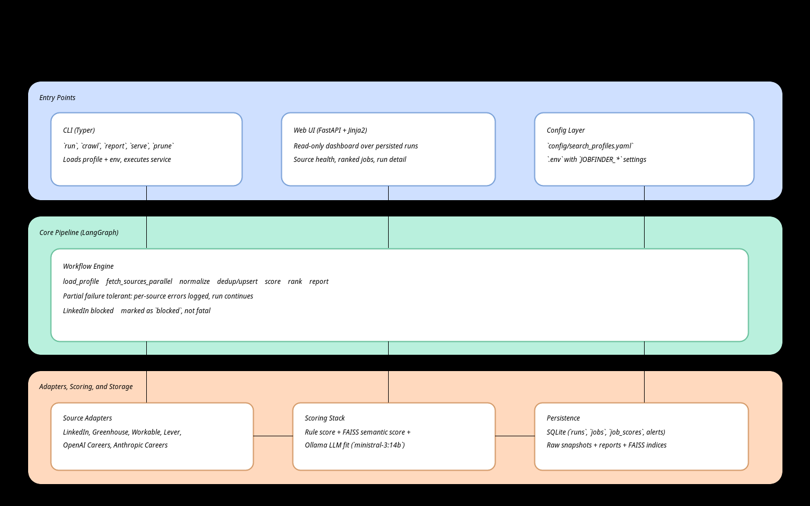

# JobFinder

Local-first AI job monitoring agent built with **Ollama + LangChain/LangGraph + Streamlit + SQLite + FAISS**, managed with **uv**.

JobFinder monitors selected public job sources, normalizes postings, ranks relevance for your profile (MLE + Applied Research in Madrid/Spain-remote), stores everything locally, and generates both CLI reports and a local web dashboard.

---

## Table of Contents

1. [What This Project Does](#what-this-project-does)
2. [Architecture and Diagrams](#architecture-and-diagrams)
3. [Quickstart (5 Minutes)](#quickstart-5-minutes)
4. [Step-by-Step: How a Run Works](#step-by-step-how-a-run-works)
5. [Scoring and Ranking Logic](#scoring-and-ranking-logic)
6. [Data Storage and Artifacts](#data-storage-and-artifacts)
7. [Configuration](#configuration)
8. [CLI Reference](#cli-reference)
9. [Web UI](#web-ui)
10. [Scheduling with systemd](#scheduling-with-systemd)
11. [Source Adapter Coverage](#source-adapter-coverage)
12. [Testing](#testing)
13. [Troubleshooting](#troubleshooting)
14. [Limitations and Safety Notes](#limitations-and-safety-notes)
15. [Extending the Project](#extending-the-project)

---

## What This Project Does

- Fetches jobs from a defined source bundle (public pages only):
  - LinkedIn (best effort)
  - DeepMind (Greenhouse)
  - Hugging Face (Workable)
  - Mistral (Lever)
  - OpenAI Careers
  - Anthropic Careers
- Runs a **LangGraph pipeline** with explicit stages for fetch, normalize, dedup, score, rank, persist, report.
- Uses hybrid ranking:
  - Rule-based score
  - Semantic relevance score (FAISS + Ollama embeddings)
  - LLM fit score (Ollama chat model)
- Saves all state locally:
  - SQLite database
  - Raw payload snapshots (`.json.gz`)
  - FAISS index files
  - Markdown + JSON digest reports
- Serves a local dashboard for run and job inspection.

---

## Architecture and Diagrams

### 1) System Architecture



Vector version: [`architecture-overview.svg`](docs/images/architecture-overview.svg)

### 2) LangGraph Pipeline


Vector version: [`langgraph-pipeline.svg`](docs/images/langgraph-pipeline.svg)

### 3) Storage Map


Vector version: [`data-storage-map.svg`](docs/images/data-storage-map.svg)

---

## Quickstart (5 Minutes)

### Prerequisites

- Linux/macOS shell
- Python 3.11+
- [`uv`](https://docs.astral.sh/uv/)
- [Ollama](https://ollama.com/) running locally

### 1) Install dependencies

```bash
cp .env.example .env
uv sync --group dev --group test
```

### 2) Ensure Ollama models are available

```bash
ollama serve
ollama pull ministral-3:14b
ollama pull nomic-embed-text
```

### 3) Run the pipeline

```bash
uv run jobfinder run --profile madrid_ml
```

Expected terminal output includes:

- `run_id=...`
- `normalized_jobs=... ranked_jobs=...`
- report paths (`report_md=...`, `report_json=...`)

Note: `run` executes one pipeline pass and exits. It does not start the Streamlit server.

### 4) Open the dashboard

```bash
uv run jobfinder serve --host 127.0.0.1 --port 8765
```

Then open: `http://127.0.0.1:8765`

---

## Step-by-Step: How a Run Works

The pipeline is implemented in `src/jobfinder/graph/workflow.py` and follows this exact order:

1. `load_profile`
- Loads selected profile and initializes run metadata.
- Persists `runs` entry and profile snapshot.

2. `expand_queries`
- Expands role/location terms from profile fields.

3. `fetch_sources_parallel`
- Calls adapters concurrently.
- Source failures are captured per-source.
- LinkedIn block/CAPTCHA is marked as `blocked` and not fatal.

4. `normalize_records`
- Writes raw payload snapshots (`data/raw/...`).
- Converts source-specific payloads to `NormalizedJobPosting`.

5. `deduplicate_and_upsert`
- Upserts canonical jobs into SQLite.
- Applies dedup window policy (default 90 days).
- Creates alerts only for unseen jobs in dedup window.

6. `rule_filter`
- Computes deterministic rule-based relevance.
- Builds candidate set for semantic/LLM steps.

7. `embedding_score`
- Creates FAISS index for this run.
- Scores semantic similarity using Ollama embeddings.

8. `llm_fit_score`
- Calls Ollama chat model for structured fit judgment.

9. `rank_and_select`
- Combines rule + semantic + llm scores using profile weights.
- Adds freshness consideration.
- Produces ranked jobs and top digest subset.

10. `persist_outputs`
- Persists source statuses and score rows.

11. `generate_digest`
- Writes Markdown and JSON reports in `data/reports/YYYY-MM-DD/`.

12. `finalize_run_status`
- Marks run status as completed/warnings/errors/failed.
- Run fails only if all sources failed/blocked/skipped.

---

## Scoring and Ranking Logic

Composite score is bounded to 0-100 and currently weighted by profile defaults:

- `rule` = 0.35
- `semantic` = 0.30
- `llm` = 0.35

Formula:

```text
total = rule_score*0.35 + semantic_score*0.30 + llm_score*0.35
```

Additional behavior:

- Rule score emphasizes title/location/skills overlap.
- LLM fit evaluates role/research/location/seniority fields.
- Fresh postings receive a small bonus inside ranking.

---

## Data Storage and Artifacts

### SQLite (`data/jobfinder.sqlite`)

Main tables:

- `runs`
- `run_source_status`
- `jobs`
- `job_versions`
- `alerts`
- `job_scores`
- `profile_snapshots`

### File outputs

- Raw source payloads:
  - `data/raw/YYYY/MM/DD/*.json.gz`
- FAISS indices:
  - `data/index/faiss/{run_id}/`
- Reports:
  - `data/reports/YYYY-MM-DD/{run_id}.md`
  - `data/reports/YYYY-MM-DD/{run_id}.json`

---

## Configuration

### Profile config

File: `config/search_profiles.yaml`

Default profile id is `madrid_ml` with:

- Target roles: MLE + Applied Research variants
- Location policy: Madrid + Spain remote
- Source toggles
- Scoring weights
- Digest size
- Dedup window

### Environment config

File: `.env` (copy from `.env.example`)

All variables are prefixed with `JOBFINDER_`, including:

- `JOBFINDER_OLLAMA_BASE_URL`
- `JOBFINDER_OLLAMA_CHAT_MODEL`
- `JOBFINDER_OLLAMA_EMBED_MODEL`
- `JOBFINDER_DB_PATH`
- `JOBFINDER_REPORT_DIR`
- `JOBFINDER_RAW_DIR`
- `JOBFINDER_VECTOR_DIR`
- `JOBFINDER_RETENTION_DAYS`

---

## CLI Reference

### Full run

```bash
uv run jobfinder run --profile madrid_ml
```

### Crawl-only mode (skip semantic+LLM scoring)

```bash
uv run jobfinder crawl --profile madrid_ml
```

### Regenerate report from persisted DB

```bash
uv run jobfinder report --profile madrid_ml --top 15
uv run jobfinder report --profile madrid_ml --run-id <RUN_ID> --top 30
```

### Serve local dashboard

```bash
uv run jobfinder serve --host 127.0.0.1 --port 8765
```

### Prune old data

```bash
uv run jobfinder prune --days 180
```

---

## Web UI

The dashboard is now a Streamlit app launched by:

```bash
uv run jobfinder serve --host 127.0.0.1 --port 8765
```

Key views:

- Run selector + source health
- Ranked jobs list with filters (text/source/score/new alerts)
- Job detail panel with original source link and latest snapshot description
- Description rendering preserves whitespace/indentation for plain text postings

---

## Scheduling with systemd

Templates are included:

- `systemd/jobfinder.service`
- `systemd/jobfinder.timer`

Timer is configured for daily `06:00`.

Typical install flow:

```bash
# copy templates to ~/.config/systemd/user or /etc/systemd/system
# adjust WorkingDirectory and paths if needed
systemctl --user daemon-reload
systemctl --user enable --now jobfinder.timer
systemctl --user list-timers | grep jobfinder
```

---

## Source Adapter Coverage

Current adapter modules:

- `src/jobfinder/adapters/linkedin_public.py`
- `src/jobfinder/adapters/greenhouse.py`
- `src/jobfinder/adapters/workable.py`
- `src/jobfinder/adapters/lever.py`
- `src/jobfinder/adapters/openai.py`
- `src/jobfinder/adapters/anthropic.py`

Adapter contract (`src/jobfinder/adapters/base.py`):

- `fetch(profile, client, browser_ctx) -> list[RawJobPosting]`
- `normalize(raw) -> NormalizedJobPosting`

---

## Testing

Run all tests:

```bash
uv run --group test pytest -q
```

Current test coverage includes:

- Unit: query expansion, rule scoring, score combiner, dedup behavior
- Adapter normalization contract tests
- Mocked end-to-end integration test with blocked LinkedIn scenario

---

## Troubleshooting

### `pytest: command not found`

Use `uv run --group test pytest -q` after `uv sync --group test`.

### Ollama connection errors

- Confirm Ollama server is running (`ollama serve`).
- Confirm `.env` base URL and model names.
- If semantic scoring falls back with `model ... not found`, run:
  - `ollama pull nomic-embed-text`

### Empty results

- Some sources may change HTML/API format.
- LinkedIn may block anonymous guest requests.
- Check per-source status in the Streamlit dashboard and generated report.
- If you copied an older `.env` with `JOBFINDER_USER_AGENT=jobfinder-bot/0.1`, change it to a browser-like user agent (see `.env.example`).

### Slow runs

- Larger local models increase LLM scoring latency.
- Use `crawl` mode for faster source validation.

---

## Limitations and Safety Notes

- Public pages only in this version (no authenticated scraping flows).
- No anti-bot bypass strategies are implemented.
- Source-specific HTML/APIs may change and require parser updates.
- Always verify opportunities manually before applying.

---

## Extending the Project

### Add a new source adapter

1. Create `src/jobfinder/adapters/<source>.py` implementing `SourceAdapter`.
2. Add adapter to `build_adapters()` in `src/jobfinder/adapters/registry.py`.
3. Add source toggle in `config/search_profiles.yaml`.
4. Add adapter normalization contract test in `tests/adapters/`.

### Add new ranking signals

- Extend `ScoreBreakdown` and/or LLM schema in `models/domain.py`.
- Add scoring component under `src/jobfinder/scoring/`.
- Merge in `combine_scores()`.

### Add UI features

- Extend repository query methods.
- Add Streamlit components in `src/jobfinder/streamlit_app.py`.

---

If you want, next step can be a **production hardening pass** focused on robust parsers for each source (with fixtures per source and schema-change detection).
